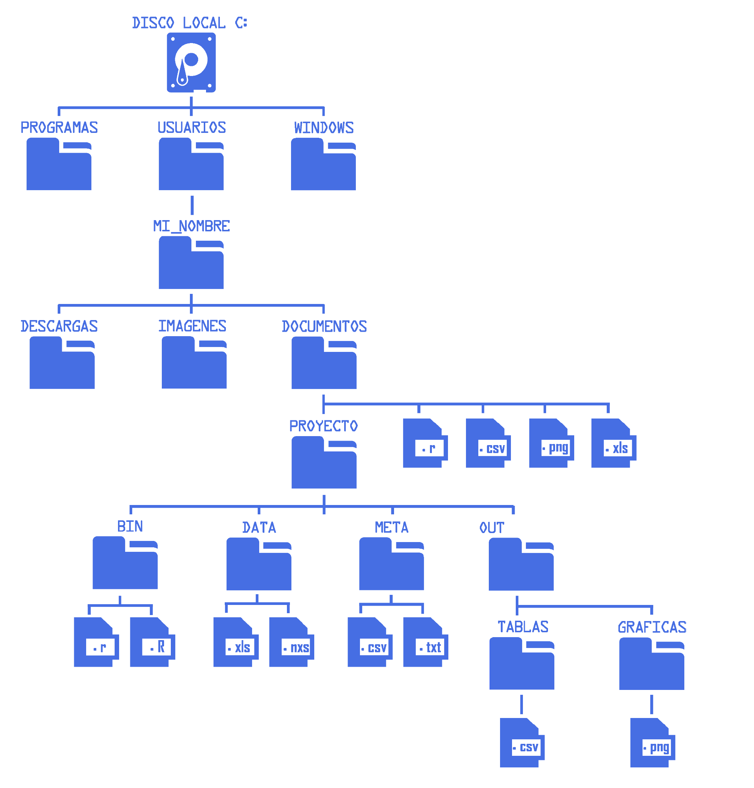

# Objetivos de aprendizaje

Al finalizar, podrás:

-   Diferenciar **terminal**, **shell** y **prompt**.

-   Entender el **sistema de archivos** de Linux y sus rutas (absolutas vs. relativas).

-   Navegar directorios y listar contenido con opciones útiles.

-   Crear, copiar, mover, renombrar y eliminar archivos y directorios con seguridad.

-   Usar el **historial**, **autocompletado** y **comodines** para trabajar más rápido.

# Terminal, shell y prompt

-   **Terminal**: programa que abre una sesión interactiva (p. ej., *GNOME Terminal*, *Konsole*, *iTerm2*).

-   **Shell**: intérprete de comandos. Aquí usamos **Bash**.

-   **Prompt**: línea donde escribes comandos, suele mostrar usuario, host y carpeta actual. Ejemplo:

    ``` bash
    usuario@equipo:~/proyecto$ _
    ```

# Sistema de archivos en Linux

-   Estructura en forma de **árbol** que comienza en la **raíz** `/`.

-   Directorios comunes: `/home`, `/etc`, `/bin`, `/usr`, `/tmp`, `/var`.

-   Tu carpeta personal suele ser `/home/tu_usuario` (también `~`).

::: callout-note **Atajos de ruta**\
`~` = home del usuario actual\
`~usuario` = home de *usuario*\
`.` = directorio actual\
`..` = directorio padre :::

## Sistema de archivos y rutas

El sistema de archivos tiene estructura jerárquica en forma de árbol, comenzando desde la raíz `/` (Linux) o desde la unidad (Windows).

{fig-align="center" width="450"}

## Ruta absoluta

Es la dirección completa desde la raíz del sistema.

**Ejemplos (Windows)**:

``` bash
C:\Usuarios\MI_NOMBRE\Documentos\PROYECTO\BIN\script.R
```

**Ejemplos (Linux)**:

``` bash
/home/usuario/Documentos/PROYECTO/BIN/script.R
```
